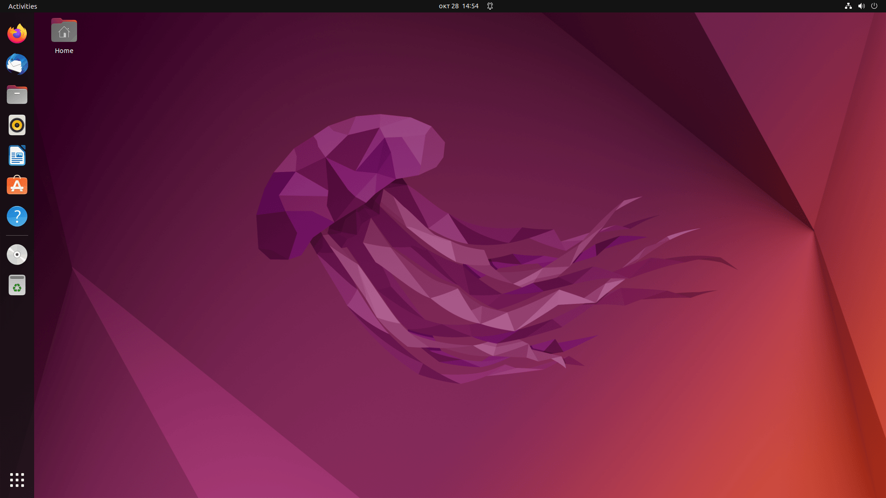

# VirtualBox and Virtual Machine Deployment Report

## 1. Installing VirtualBox

### 1.1 Download and Installation

VirtualBox was downloaded from the official website (https://www.virtualbox.org/). The version compatible with my operating system was selected for download and installation.

### 1.2 Version

The installed version of VirtualBox is 6.1.26.

## 2. Deploying a Virtual Machine

### 2.1 Creating a New Virtual Machine

A new Virtual Machine (VM) was created using VirtualBox. The Ubuntu 22 operating system was selected during the setup.

### 2.2 Customizing VM Settings

The settings of the VM were customized as follows:
- Allocated Memory: 4096 MB
- Number of CPU cores: 2
- Network Configuration: NAT

### 2.3 Deployment Steps

The steps followed to deploy the VM are as follows:

1. Opened VirtualBox and clicked on "New" to create a new VM.
2. Named the VM and selected "Ubuntu" as the operating system.
3. Allocated 4096 MB of memory to the VM.
4. Created a virtual hard disk.
5. Selected VDI (VirtualBox Disk Image) as the hard disk file type.
6. Chose "Dynamically allocated" as the storage on physical hard disk.
7. Allocated 10 GB as the file location and size.
8. Went to the settings of the VM to set the number of CPUs to 2 under the "System" -> "Processor" tab.
9. Under the "Network" tab, set the "Attached to" option to "NAT".
10. Clicked "Start" to run the VM.

This concluded the setup and deployment of the Ubuntu VM on VirtualBox.

### 2.4 Screenshot of the VM

